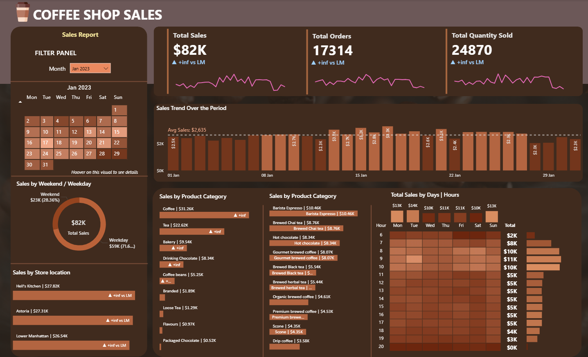

# ☕ Coffee Shop Sales Analytics (MySQL + Power BI)

## 📊 Project Overview  
This project analyzes **Coffee Shop Sales Data** using **MySQL** and visualizes the insights through an interactive **Power BI Dashboard**.  

The goal was to measure and monitor key business metrics — **Total Sales, Total Orders, and Total Quantity Sold** — and identify **Month-on-Month (MoM)** performance trends.  
The dashboard provides insights into **store performance**, **daily and hourly trends**, and **weekday vs weekend patterns** to support business decisions.

---

## 🎯 Key Features  

### 🧮 KPI Analysis
- Calculate **Total Sales**, **Total Orders**, and **Total Quantity Sold** for each month.  
- Measure **Month-on-Month Difference** and **Growth Percentage** in sales, orders, and quantity.  
- Track performance fluctuations across time periods.

### 📅 Calendar Heat Map
- Dynamic heat map that adjusts based on the selected month.  
- Each day color-coded to represent sales volume.  
- Tooltips display daily metrics — Sales, Orders, and Quantity.

### 📈 Daily Sales Trend
- Line chart showing daily sales with an **average sales line**.  
- Highlights days performing **above or below average**.

### 🏬 Sales by Store Location
- Compare total sales across store locations.  
- Show **Month-on-Month differences** to identify trends and growth opportunities.

### ☕ Product Analysis
- Sales performance by **Product Category**.  
- Identify **Top 10 Best-Selling Products** by total sales volume.

### 🕒 Sales by Day & Hour
- Heat map showing sales patterns across weekdays and working hours.  
- Identify **peak sales hours** and **low-performing time slots**.

---

## 🧰 Tools & Technologies Used  

| Tool / Technology | Purpose |
|--------------------|----------|
| **MySQL** | Data cleaning, transformation, and KPI calculation through SQL queries. |
| **Power BI** | Dashboard creation and visualization of metrics & trends. |
| **Excel / CSV** | Raw data preparation and validation. |
| **GitHub** | Project version control and documentation. |

---

## 🧑‍💻 SQL Functionalities Used  
`STR_TO_DATE`, `ROUND`, `SUM`, `COUNT`, `AVG`, `LAG`, `MONTH`, `DAY`, `DAYOFWEEK`,  
`HOUR`, `CASE`, `GROUP BY`, `ORDER BY`, `LIMIT`, `WINDOW FUNCTIONS`,  
`JOINS`, `SUBQUERIES`, `ALTER TABLE`, `UPDATE`, `CHANGE COLUMN`

---

## ⚙️ Process Workflow  

1. **Data Walkthrough** — Understanding dataset structure and fields.  
2. **Data Cleaning** — Fixed data types and removed anomalies.  
3. **Transformations** — Converted string dates and times into correct formats.  
4. **KPI Querying** — Wrote SQL for all business and KPI requirements.  
5. **Visualization** — Designed interactive Power BI dashboard using clean data.  
6. **Documentation** — Stored SQL scripts and Power BI files for reproducibility.

## 📊 Power BI Dashboard

This Power BI dashboard visualizes the key metrics derived from MySQL data for the **Coffee Shop Sales Analysis** project.  
It helps track performance trends, identify peak sales periods, and monitor business growth efficiently.

---

### ☕ Dashboard Overview

### 🧠 Dashboard Tooltip View
Interactive tooltip showing product-level insights on hover.
.png)

---

## 🧮 DAX Measures Used

Below are key DAX measures used to calculate KPIs and Month-on-Month (MoM) growth.

### 📆 Current Month Calculations

### 📈 Month-on-Month Growth

---

## 🧾 Key Insights Summary

Here are some major takeaways from the **Coffee Shop Sales Analysis (MySQL + Power BI)** project:

- ☕ **May recorded the highest sales** and order volume across all months — indicating peak business activity.  
- 📈 **Consistent Month-on-Month (MoM) growth** observed in both sales and quantity, showing positive performance trends.  
- 🗓️ **Weekdays outperform weekends** in sales, likely due to regular customer visits during working days.  
- 🏬 **Store Location Analysis** revealed specific branches contributing significantly higher revenue, helping target local promotions.  
- 🕒 **Hourly trend analysis** showed early mornings and evenings as key sales hours — useful for staff scheduling.  

---

💡 **Overall Impact:**  
This project demonstrates how SQL-based data modeling and Power BI visualization can be combined to deliver powerful, data-driven business insights — enabling better decision-making for sales optimization and operational planning.

---  
## 📝 Author  
**Shuchita Jaiswal**  
📧 shuchita0201@gmail.com  
🔗 https://www.linkedin.com/in/shuchitajaiswal/ 

